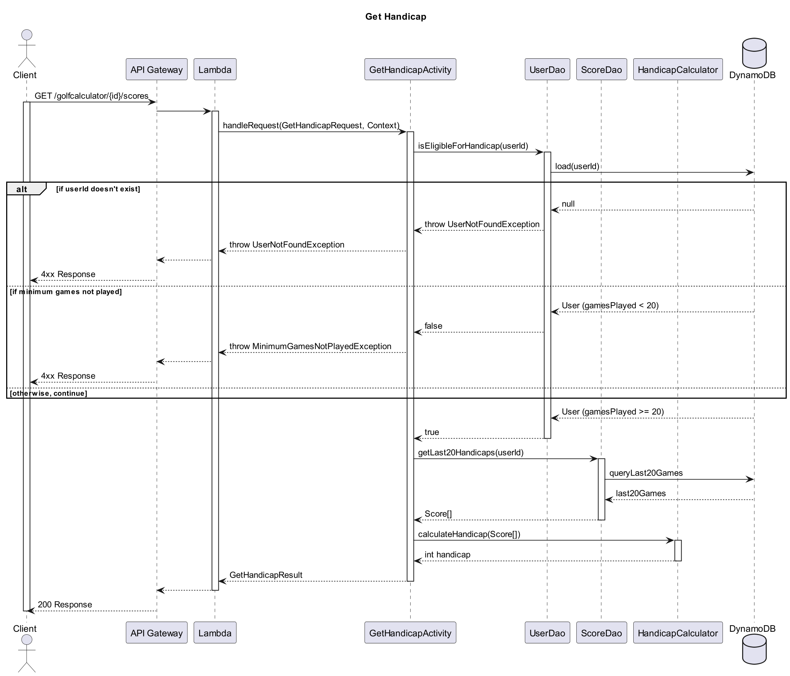

# A-Rod Design Document

## Golf Handicap Score Calculator Design

## 1. Problem Statement

*I want to create a convenient means to figure out the standardized score of my golf games. 
Every golf course has a course rating and slope rating that are used in a formula, with your golf score, to determine what is called a "handicap". 
This allows players to determine how well they played regardless of the difficulty of the course they are on.*

## 2. Top Questions to Resolve in Review

1.   I will need to figure out exactly how I want to store date/time of scores, such as what format, for DyanamoDB.
2.   Need to know how to query, so I can extract the right amount of scores, in descending order sorted by date/time, associated with the same userId.
3.  Will need to figure out how to create my html site, and how to make it leverage the APIs automatically, so the User doesn't need to know how to code, as I've only learned how to manually use APIs through the commandline, but obviously this needs to be programmed within the html site I'm assuming.

## 3. Use Cases

U1. As a customer, I should be able to make an account, with a username and email, 
to be able to keep track of my scores overtime and retrieve them.
    
U2. As a customer, I want to be able to view the handicap of the golf score I am logging 
in after submitting it.

U3. As a customer, I want to be able to view my overall current handicap when I 
select "view current handicap", which is officially determined by calculating the average 
of the 8 best handicaps from the last 20 played games.

U4. As a customer, I want to view my last 5 handicap scores when I select 
"view latest handicaps".

## 4. Project Scope

I want users to be able to see the handicap of the game they just played, their overall
handicap (best 8 of last 20 games), and their last 5 handicaps.

### 4.1. In Scope

I believe I can solve all parts of the problem that I have mentioned as there isn't much 
extra work involved in each part. 

### 4.2. Out of Scope

I would like to add some analytics, such as a graph to visualize performance over time, 
and this can be expanded further to choose the time horizon that you want to visualize 
your performance such as: last month, last 3 months, 6 months, year, or overall. I would 
also like to add the ability to track performance for each golf course, with a graph 
available for that too. 

Also, currently users would have to manually figure out and plug
in the course and slope ratings of the course they played at, and in the future I would
like to have that information stored for all golf courses, so that users only have to
worry about plugging in their score, making it easier. 

I think just simply making the website look organized, pretty, and colorful 
and adding as much cool analytical and visual features as possible would make 
my app more fun to use. 

Also a dropdown feature to put recent golf courses submitted so users don't
have to manually rewrite the same golf course names everytime. 

# 5. Proposed Architecture Overview

- The User and Score classes represent all the data we will be storing into DynamoDB.
- Will have a UserDao and ScoreDao to GET and POST. 
- Main activities and lambda functions: CreateNewScoreActivity, CreateUserActivity, GetHandicapActivity, and GetLatestGamesActivity.
- For the listed activity classes there will be a Provider, Request, and Result class. 
- UserModel and ScoreModel classes will be used to create independence between what we are storing and what we let users see, and will be part of the Result classes.
- Will need ModelConverter to create Model classes.
- HandicapCalculator class to separate calculation logic of standardizedScore. 
- Dagger Framework will be used to streamline dependency injection.
- Proposed architecture not only accomplishes all use cases, but also creates a very organized, modular architecture, which is the best practice for scalability, testing, and collaboration.

# 6. API

## 6.1. Public Models

- UserModel: userId, email, gamesPlayed.
- ScoreModel: userId, date, courseName, standardizedScore

## 6.2. *First Endpoint* GetHandicapActivity

Only data required to initiate is the userId. Official handicap scores require
at least 20 games played, so first we will use the UserDao to check that the
user exists in the UserTable. Then, we will make sure that gamesPlayed attribute
is >= 20. If not then either UserNotFoundException or 
MinimumGamesNotPlayedException will get triggered, and the user will get a
400 response. 

If the user is eligible for an official handicap calculation, then the 
ScoreDao will query the last 20 scores associated with the userId from the
ScoresTable. Then the 8 best scores will be extracted, then averaged, then
returned to the User with a 200 response. 

*(You should have a separate section for each of the endpoints you are expecting
to build...)*

## 6.3 *Second Endpoint* GetLatestGamesActivity

This endpoint is very similar to GetHandicapActivity that we discussed in the
last section. Just like before we only need the userId, and we can throw
a UserNotFoundException. There is also still a MinimumGamesNotPlayedException,
but the difference is only 1 game is required rather than 20. However, it will
return up to 5 of the latest games if possible. 

No calculations will be required, but we will need to leverage the ModelConverter
to convert Score objects to ScoreModel objects, as there is a lot more 
information stored in the ScoreTable than we need to show to the User. Then,
we can insert the ScoreModels into the GetLatestGamesResults that will be
returned to the User with a 200 response code. 

# 7. Tables

UserTable (Stores the User class attributes):
- userId : String, partition key
- email : String
- gamesPlayed : int

ScoresTable (Stores the Score class attributes):
- userId : String, partition key
- date : date/time object, sort key
- standardizedScore : int
- rawScore : int
- courseName : String
- courseRating : int
- slopeRating : int

# 8. Pages

